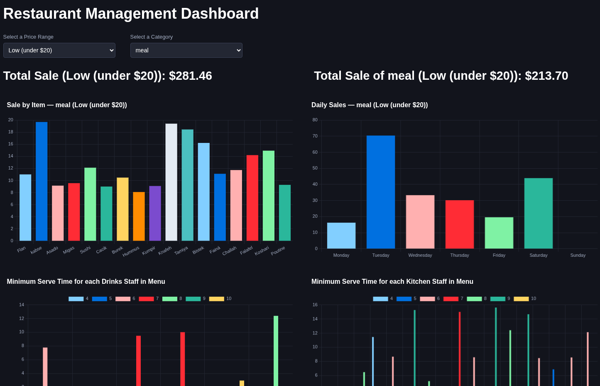

# Static Dashboard

Dashboard estático simple que recrea con [Chart.js](https://www.npmjs.com/package/chart.js) el [dashboard realizado](https://github.com/DomWatcharin/Streamlit-Dashboard) por [DomWatcharin](https://github.com/DomWatcharin) using calling [FakeStoreAPI](https://fakestoreapi.com/products) and [TheMealDB API](https://www.themealdb.com/api/json/v1/1/search.php?s=).

    

